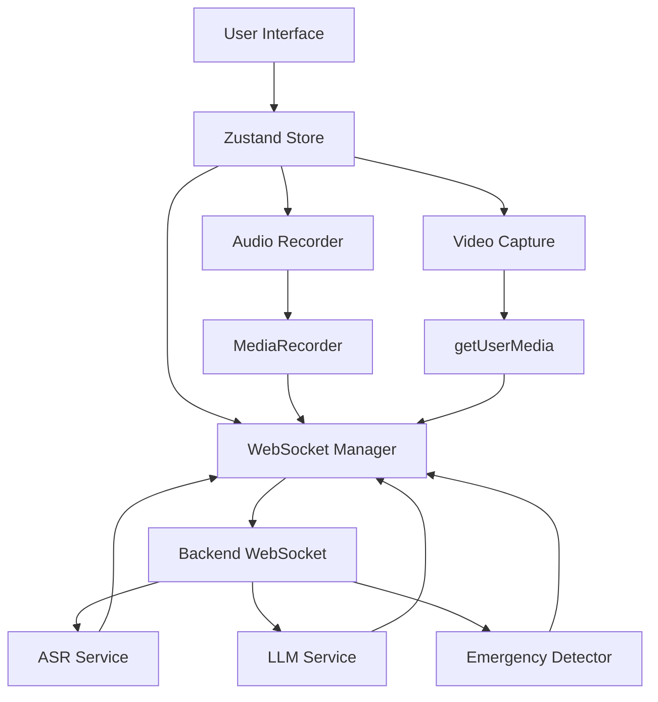

# 🩺 Cura AI Frontend

**Version:** v1.0.0 (Buildathon MVP)  
**Framework:** Next.js 14 with App Router  
**Real-time Features:** Voice Streaming, Video Streaming, Emergency Detection

---

## 📋 Table of Contents

- [Overview](#overview)
- [Features](#features)
- [Tech Stack](#tech-stack)
- [Project Structure](#project-structure)
- [Setup & Installation](#setup--installation)
- [Environment Variables](#environment-variables)
- [Usage](#usage)
- [WebSocket Events](#websocket-events)
- [Architecture](#architecture)
- [Development](#development)
- [Production Build](#production-build)
- [Troubleshooting](#troubleshooting)

---

## 🎯 Overview

Cura AI is a real-time medical emergency assistant frontend that provides:
- **Text Chat Mode**: ChatGPT-style interface for medical queries
- **Realtime Voice Mode**: Live voice interaction with ASR transcription
- **Video Streaming**: Optional camera feed for visual context
- **Emergency Detection**: Smart alerts with guided instructions
- **Responsive UI**: Clean, medical-themed interface

---

## ✨ Features

### 💬 Chat Interface
- Real-time text messaging
- Streaming LLM responses
- Message history with timestamps
- Smooth animations

### 🎤 Realtime Voice Mode
- WebSocket-based voice streaming
- Live Whisper ASR transcription
- Waveform visualization
- Auto-transcription subtitles
- Voice activity detection

### 📹 Video Support (Optional)
- Camera preview with live feed
- Automatic frame capture (320×240 JPEG)
- 1-2 second frame interval
- Device selection

### 🚨 Emergency Alerts
- Real-time emergency state detection
- Visual alert cards with guidance
- One-tap emergency calling (108/112)
- Animated alert indicators
- State-based instructions

### ⚙️ Settings
- Light/Dark mode toggle
- Audio device selection
- Video device selection
- Subtitle preferences
- Persistent settings storage

---

## 🛠 Tech Stack

- **Framework**: Next.js 14 (App Router)
- **Language**: TypeScript
- **Styling**: Tailwind CSS + ShadCN UI
- **State Management**: Zustand (with persistence)
- **Animations**: Framer Motion
- **Icons**: Lucide React
- **Audio/Video**: Browser MediaRecorder API
- **WebSocket**: Native WebSocket API
- **LLM Provider**: OpenRouter (temporary)

---

## 📁 Project Structure

```
frontend/
├── app/
│   ├── page.tsx                    # Landing page
│   ├── layout.tsx                  # Root layout
│   ├── chat/[id]/page.tsx          # Main chat interface
│   ├── signin/page.tsx             # Sign-in page
│   ├── signup/page.tsx             # Sign-up page
│   └── dashboard/                  # Dashboard pages
├── components/
│   ├── chat/
│   │   ├── ChatWindow.tsx          # Message display
│   │   ├── MessageBubble.tsx       # Individual messages
│   │   └── ChatInputBar.tsx        # Input with controls
│   ├── realtime/
│   │   ├── WaveformVisualizer.tsx  # Audio visualization
│   │   ├── VideoPreview.tsx        # Camera preview
│   │   └── RealtimeModeUI.tsx      # Realtime overlay
│   ├── emergency/
│   │   └── EmergencyAlertCard.tsx  # Emergency alerts
│   ├── layout/
│   │   ├── SidebarChatList.tsx     # Chat history sidebar
│   │   └── TopBar.tsx              # Top navigation
│   ├── settings/
│   │   └── SettingsDialog.tsx      # Settings modal
│   └── ui/                         # ShadCN components
├── store/
│   └── chatStore.ts                # Zustand global state
├── lib/
│   ├── websocket.ts                # WebSocket manager
│   ├── audio.ts                    # Audio recording utilities
│   ├── video.ts                    # Video capture utilities
│   └── utils.ts                    # Helper functions
├── styles/
│   └── globals.css                 # Global styles
├── public/                         # Static assets
├── .env.local                      # Environment variables
├── .env.example                    # Environment template
└── README.md                       # This file
```

---

## 🚀 Setup & Installation

### Prerequisites
- Node.js 18+ and npm/yarn/pnpm
- Modern browser with WebRTC support
- Microphone and camera (for realtime features)

### Installation Steps

1. **Clone the repository**
```bash
git clone https://github.com/yourusername/cura-ai-frontend.git
cd cura-ai-frontend
```

2. **Install dependencies**
```bash
npm install --legacy-peer-deps
# or
yarn install
# or
pnpm install
```

3. **Set up environment variables**
```bash
cp .env.example .env.local
```

Edit `.env.local` and add your configuration:
```env
NEXT_PUBLIC_SUPABASE_URL=your-supabase-url
NEXT_PUBLIC_SUPABASE_ANON_KEY=your-supabase-anon-key
NEXT_PUBLIC_OPENROUTER_KEY=your-openrouter-api-key
NEXT_PUBLIC_API_BASE_URL=http://localhost:8000
NEXT_PUBLIC_WS_BASE_URL=ws://localhost:8000
```

4. **Run the development server**
```bash
npm run dev
```

5. **Open your browser**
Navigate to [http://localhost:3000](http://localhost:3000)

---

## 🔐 Environment Variables

| Variable | Description | Required |
|----------|-------------|----------|
| `NEXT_PUBLIC_SUPABASE_URL` | Supabase project URL | Yes |
| `NEXT_PUBLIC_SUPABASE_ANON_KEY` | Supabase anonymous key | Yes |
| `NEXT_PUBLIC_OPENROUTER_KEY` | OpenRouter API key | Yes |
| `NEXT_PUBLIC_API_BASE_URL` | Backend REST API URL | Yes |
| `NEXT_PUBLIC_WS_BASE_URL` | Backend WebSocket URL | Yes |
| `NEXT_PUBLIC_APP_NAME` | Application name | No |
| `NEXT_PUBLIC_APP_VERSION` | Application version | No |

---

## 📖 Usage

### Text Chat Mode

1. Click "Get Started" or create a new chat
2. Type your medical query in the input box
3. Press Enter or click Send
4. Receive streaming AI responses

### Realtime Voice Mode

1. Click the **Microphone** button in the input bar
2. Allow microphone permissions
3. Speak naturally - see live transcription
4. Receive real-time AI guidance
5. Click **Stop** to exit realtime mode

### Video Mode (Optional)

1. Enable Realtime mode first
2. Click the **Camera** button
3. Allow camera permissions
4. Video frames sent automatically

### Emergency Alerts

- System detects emergency states automatically
- Red alert card appears with guidance
- Follow instructions carefully
- Click **Call 108/112** for immediate help

---

## 📡 WebSocket Events

### Client → Server

| Event | Description | Payload |
|-------|-------------|---------|
| `audio_chunk` | PCM16 audio data | `{ audio: number[], format, sampleRate }` |
| `video_frame` | JPEG frame data | `{ frame: string, format }` |
| `text_message` | Text message | `{ text: string }` |
| `user_intent` | User action/intent | `{ intent: string }` |

### Server → Client

| Event | Description | Payload |
|-------|-------------|---------|
| `transcription` | ASR result | `{ text: string }` |
| `intermediate_response` | Streaming chunk | `{ text: string }` |
| `final_response` | Complete response | `{ text: string }` |
| `emergency_state_update` | Emergency detected | `{ state: string, message: string }` |
| `conversation_metadata` | Session info | `{ ... }` |
| `error` | Error message | `{ error: string }` |

---

## 🏗 Architecture



### Data Flow

**Text Mode:**
```
User Input → REST API → RAG → LLM → Streaming Response → UI
```

**Realtime Mode:**
```
Microphone → Audio Chunks → WebSocket → ASR → LLM → Streaming → UI
```

**Emergency Detection:**
```
Backend Analysis → WebSocket Event → Emergency State → Alert UI
```

---

## 💻 Development

### Available Scripts

```bash
# Development server
npm run dev

# Build for production
npm run build

# Start production server
npm start

# Run linter
npm run lint
```

### Key Development Files

- **State Management**: `store/chatStore.ts`
- **WebSocket Logic**: `lib/websocket.ts`
- **Audio Processing**: `lib/audio.ts`
- **Video Capture**: `lib/video.ts`
- **Main Chat Page**: `app/chat/[id]/page.tsx`

---

## 🚢 Production Build

```bash
# Build the project
npm run build

# Start production server
npm start

# Or deploy to Vercel
vercel deploy
```

### Environment Setup

Ensure all production environment variables are set in your hosting platform.

---

## 🐛 Troubleshooting

### Microphone Not Working

- Check browser permissions
- Verify device selection in Settings
- Try different audio input device

### Camera Not Working

- Allow camera permissions
- Check device selection in Settings
- Ensure camera not in use by other apps

### WebSocket Connection Failed

- Verify backend is running
- Check `NEXT_PUBLIC_WS_BASE_URL`
- Ensure CORS is configured on backend

### Supabase Auth Issues

- Verify Supabase credentials in `.env.local`
- Check Supabase project settings
- Ensure auth is enabled in Supabase dashboard

### Build Errors

```bash
# Clear cache and reinstall
rm -rf node_modules .next package-lock.json
npm install --legacy-peer-deps
npm run build
```

---

## 📝 License

MIT License - See LICENSE file for details

---

## 🤝 Contributing

Contributions welcome! Please follow:
1. Fork the repository
2. Create a feature branch
3. Make your changes
4. Submit a pull request

---

## 📧 Support

For issues or questions:
- GitHub Issues: [Create an issue](https://github.com/yourusername/cura-ai/issues)
- Email: support@cura-ai.com

---

## 🙏 Acknowledgments

- Next.js Team
- ShadCN UI
- Framer Motion
- OpenRouter
- Supabase

---

**Built with ❤️ for Buildathon MVP**
